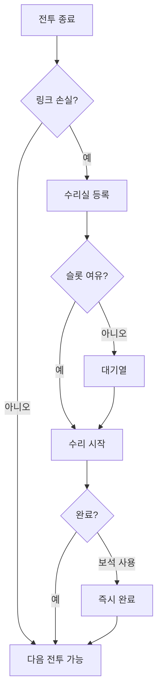

# 수리 시스템

[← 영웅 시스템으로 돌아가기](../영웅%20시스템.md) | [← README로 돌아가기](../../README.md)

---

## 수리 개념

### 전투 후 관리

- 전투에서 손상된 링크는 수리 필요
- 수리하지 않으면 다음 전투에 손상 상태로 참전

---

## 수리 비용

### 비용 구성

- **골드** (기본 화폐)
- **인력** (영지에서 생산하는 자원)

### 손실 정도별 비용

| 손실 | 골드 | 인력 | 수리 시간 |
|------|------|------|-----------|
| 1링크 손실 | 100 | 1 | 10분 |
| 2링크 손실 | 200 | 2 | 30분 |
| 3링크 손실 | 350 | 4 | 1시간 |
| 4링크 손실 | 500 | 7 | 2시간 |
| 영웅 전사 | 1000 | 10 | 4시간 |

### 보석으로 즉시 수리

- 즉시 완료 옵션 제공
- 보석 소모량은 남은 시간에 비례

---

## 수리실 시스템

### 수리 슬롯

- 기본: 2슬롯 (동시 2명 수리 가능)
- 확장: 보석 또는 영지 업그레이드로 최대 4슬롯

### 수리 대기열

- 슬롯 초과 시 대기
- 순서대로 자동 진입

### 수리 흐름

---

## 전투 전 보급

### 자동 보급

- 전투 시작 전 모든 링크 100% 상태
- 별도 보급 과정 불필요
- **단, 수리 미완료 시 손상 상태로 출격**

---

## 수리 전략

### 효율적 운영

| 전략 | 설명 |
|------|------|
| 교대 편성 | 수리 중인 영웅 대신 다른 영웅 투입 |
| 여유 슬롯 확보 | 주력 영웅 빠른 복귀를 위해 슬롯 확장 |
| 자원 비축 | 골드/인력 여유분 확보 |

### 수리 우선순위

1. 주력 딜러/탱커 우선
2. 전사한 영웅 (비용 높음) 후순위
3. 교체 가능한 영웅은 대기

---

## 관련 문서

- [링크 시스템](링크%20시스템.md) - 링크 손실 메커니즘
- [영지 시스템](../영지%20시스템.md) - 수리실, 인력 생산
- [재화 시스템](../재화%20시스템.md) - 골드/보석/인력
