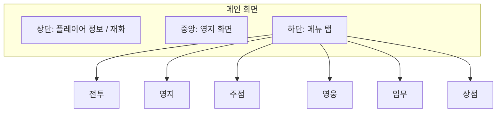

# UI 설계

[← README로 돌아가기](../README.md)

---

## 메인 화면 구성

---

## 전투 UI 구조

---

## 시각 목업

자세한 UI 레이아웃은 [UI 레이아웃](../UI_레이아웃.html) 참조

---

## 관련 문서

- [스테이지 시스템](스테이지%20시스템.md) - 전투 UI 상세
- [기술 요구사항](기술%20요구사항.md) - 해상도/스케일
