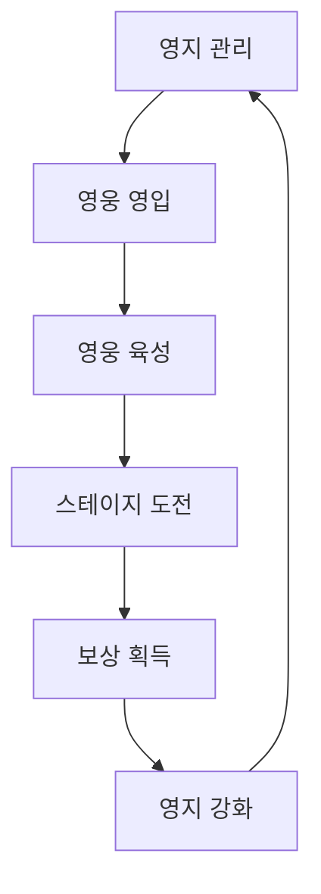
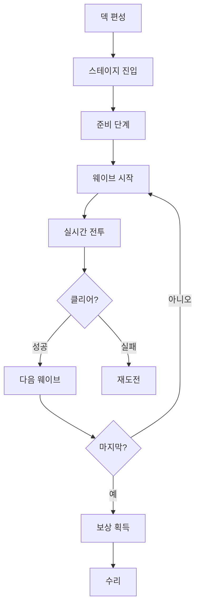

# 게임 개요

[← README로 돌아가기](../README.md)

---

## 기본 정보

| 항목 | 내용 |
|------|------|
| **게임명** | (미정) |
| **장르** | 디펜스 RPG |
| **플랫폼** | 모바일 (iOS/Android) |
| **화면 방향** | 가로 (Landscape) |
| **시점** | 쿼터뷰 (탑뷰 개념) |
| **타겟** | 서브컬처 게임 유저, 디펜스 장르 선호층 |

---

## 핵심 게임 루프

### 메타 루프 (중장기)

### 전투 루프 (단기)

---

## 관련 문서

- [스테이지 시스템](스테이지%20시스템.md)
- [전투 메카닉](전투%20메카닉.md)
- [영웅 시스템](영웅%20시스템.md)
- [영지 시스템](영지%20시스템.md)
