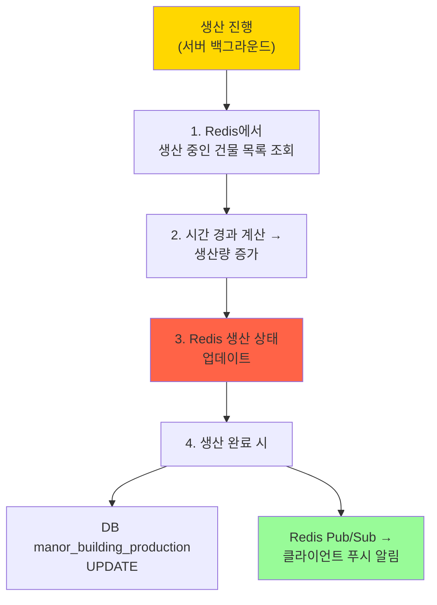

# 데이터 아키텍처

[← README로 돌아가기](../README.md)

---

## 개요

Fantasy Tower Defence의 데이터 저장소 계층 구조 및 데이터 흐름을 정의합니다.

---

## 저장소 계층

### 1. DB (데이터베이스)

**목적**: 영구 저장, 트랜잭션 보장

| 항목 | 설명 |
|------|------|
| **DBMS** | MySQL / PostgreSQL |
| **용도** | 유저 게임 데이터 영속화 |
| **특징** | ACID 보장, 관계형 데이터 구조 |
| **저장 데이터** | 유저 프로필, 건물 배치, 영역 해금, 인벤토리 등 |

**주요 테이블**:
- `manor_user` - 유저 영지 상태
- `manor_building_placement` - 건물 배치 정보
- `manor_unlocked_tiles` - 영역 해금 데이터
- `manor_building_production` - 생산 상태 (영구 기록)

---

### 2. Redis

**목적**: 캐싱, 실시간 상태 관리, 세션

| 항목 | 설명 |
|------|------|
| **저장소 타입** | In-Memory Key-Value Store |
| **용도** | 빠른 읽기, 임시 상태, 공유 데이터 |
| **특징** | 고속 액세스, TTL 지원, Pub/Sub |
| **저장 데이터** | Config 캐시, 생산 진행 상태, 유저 세션, 실시간 카운터 |

**주요 데이터 구조**:

```redis
# Config 캐시 (로그인 시 1회 로드, Redis에 캐싱)
config:manor:building:{building_id}     # Hash
config:manor:global                      # Hash

# 유저 세션
session:user:{user_id}                   # Hash (TTL: 24h)

# 생산 진행 상태 (실시간 업데이트)
manor:production:{user_id}:{placement_id}  # Hash
  - resource_type: "food"
  - stored_amount: 120
  - last_harvest_at: "2024-06-01T12:00:00Z"
  - production_rate: 10.5

# 실시간 카운터
manor:online_users                       # Set
```

---

## 데이터 흐름

### Config 데이터 로드 (로그인 시)


---

### 유저 데이터 읽기 (영지 진입 시)


---

### 유저 데이터 쓰기 (건물 배치)


---

### 실시간 생산 업데이트



---

## 캐시 전략

### Config 데이터

- **전략**: Cache-Aside (Lazy Loading)
- **TTL**: 1시간
- **갱신**: 배포 시 Redis FLUSHDB 또는 버전 키 변경

### 유저 데이터

- **전략**: Write-Through (쓰기 시 DB + Redis 동시 갱신)
- **TTL**: 10분 (활성 유저는 TTL 자동 갱신)
- **갱신**: API 호출 시 자동

### 생산 상태

- **전략**: Redis 메인 저장소, 주기적 DB 동기화
- **동기화**: 1분마다 또는 수확 시 DB 저장
- **복구**: 서버 재시작 시 DB에서 Redis로 복원

---

## 트랜잭션 처리

### DB 트랜잭션 범위

**필수 트랜잭션**:
- 건물 배치/이동 + 자원 차감
- 영역 확장 + 자원 차감
- 건물 업그레이드 + 자원 차감

**예시**:
```sql
BEGIN;
  INSERT INTO manor_building_placement (...);
  UPDATE manor_user SET silver = silver - 500 WHERE user_id = ?;
COMMIT;
```

---

### Redis 트랜잭션 (MULTI/EXEC)

**사용 케이스**: 여러 Redis 키 동시 갱신

```redis
MULTI
  HSET manor:user:123 silver 1500
  HSET manor:building:456 level 3
EXEC
```

---

## 장애 복구

### Redis 장애

1. **캐시 미스**: DB에서 조회 → 성능 저하, 서비스 정상
2. **복구**: Redis 재시작 → 캐시 워밍업 (주요 유저 데이터 사전 로드)

### DB 장애

1. **읽기 전용 모드**: Redis 캐시만 사용 (제한적 서비스)
2. **쓰기 실패**: 클라이언트 에러 반환, 재시도 유도

---

## 데이터 일관성

### 최종 일관성 (Eventual Consistency)

- **생산 상태**: Redis 주기적 동기화 → DB
- **허용 범위**: 최대 1분 지연

### 강한 일관성 (Strong Consistency)

- **자원 차감**: DB 트랜잭션 + Redis 즉시 갱신
- **건물 배치**: DB 저장 완료 후 Redis 반영

---

## 성능 최적화

### 읽기 최적화

1. **Config 데이터**: Redis 캐싱 (DB 부하 99% 감소)
2. **유저 데이터**: Redis 우선 조회 (응답 시간 50ms → 5ms)
3. **배치 읽기**: MGET, HMGET 활용

### 쓰기 최적화

1. **비동기 DB 저장**: 생산 상태 주기적 동기화
2. **배치 쓰기**: 여러 유저 데이터 한 번에 저장
3. **Redis Pipeline**: 여러 명령 한 번에 전송

---

## 모니터링

### 주요 지표

| 지표 | 목표 | 알람 조건 |
|------|------|-----------|
| Redis 캐시 히트율 | > 95% | < 90% |
| DB 쿼리 응답 시간 | < 50ms | > 100ms |
| Redis 메모리 사용률 | < 70% | > 80% |
| 데이터 동기화 지연 | < 1분 | > 3분 |

---

## 관련 문서

- [데이터 테이블](데이터%20테이블.md) - 전체 DB 스키마
- [영지/데이터 명세](영지/데이터%20명세.md) - 영지 시스템 데이터 상세
- [용어 사전](../용어%20사전.md) - 공식 용어 정의
