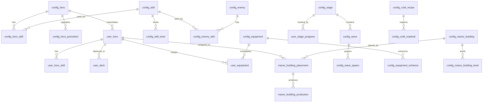

# 데이터 테이블 설계

[← README로 돌아가기](../README.md)

---

## 개요

게임 시스템 구현에 필요한 설정(Config) 테이블과 유저 DB(User Data) 테이블을 정의합니다. 밸런싱 조정은 Config 테이블 데이터만 변경하여 코드 수정 없이 가능합니다.

> **아키텍처**: DB/Redis 저장소 계층 및 데이터 흐름은 [데이터 아키텍처](데이터%20아키텍처.md) 문서 참조

### 테이블 분류

| 분류 | 설명 | 변경 빈도 |
|------|------|-----------|
| Config | 게임 설정 데이터, 모든 유저 공통 | 패치/밸런싱 시 |
| User Data | 유저별 진행 데이터 | 실시간 |

### 시스템별 테이블 위치

이미 상세 문서에 테이블이 정의된 시스템은 해당 문서를 참조합니다.

| 시스템 | 테이블 정의 위치 |
|--------|-----------------|
| 영지 (Manor) | [영지/데이터 명세](영지/데이터%20명세.md) |
| 적/스테이지 | [적 시스템](적%20시스템.md) |
| 장비 | [장비 시스템](장비%20시스템.md) |
| 영웅/스킬/재화/진행 | **이 문서** |

---

## 영웅 테이블

### config_hero (영웅 마스터)

| 컬럼 | 타입 | 설명 |
|------|------|------|
| hero_id | VARCHAR(10) | PK (H001 등) |
| hero_name | VARCHAR(50) | 영웅명 |
| initial_grade | INT | 초기 등급 (1~5) |
| role | VARCHAR(20) | 역할 (tank/melee_dps/ranged_dps/mage/support) |
| race | VARCHAR(20) | 종족 (Phase 2: 속성 연계용) |
| element | VARCHAR(10) | 속성 (nullable, Phase 2) |
| base_hp | INT | Lv.1 HP |
| base_atk | INT | Lv.1 ATK |
| base_mag | INT | Lv.1 MAG |
| base_def | INT | Lv.1 DEF |
| base_res | INT | Lv.1 RES |
| base_spd | DECIMAL(3,2) | Lv.1 SPD |
| base_mov | DECIMAL(3,2) | Lv.1 MOV |
| base_rng | INT | 사거리 |
| base_crt | DECIMAL(4,3) | 기본 치명타율 (0.05 = 5%) |
| base_eva | DECIMAL(4,3) | 기본 회피율 |
| growth_hp | DECIMAL(5,2) | 레벨당 HP 성장 |
| growth_atk | DECIMAL(5,2) | 레벨당 ATK 성장 |
| growth_mag | DECIMAL(5,2) | 레벨당 MAG 성장 |
| growth_def | DECIMAL(5,2) | 레벨당 DEF 성장 |
| growth_res | DECIMAL(5,2) | 레벨당 RES 성장 |

### config_hero_promotion (승급)

| 컬럼 | 타입 | 설명 |
|------|------|------|
| id | INT | PK |
| from_grade | INT | 현재 등급 |
| to_grade | INT | 승급 후 등급 |
| required_level | INT | 필요 레벨 |
| cost_silver | INT | 은화 비용 |
| material_id | VARCHAR(10) | 승급 재료 ID |
| material_count | INT | 재료 수량 |
| level_cap_after | INT | 승급 후 레벨 상한 |

**초기 데이터:**

| from_grade | to_grade | required_level | cost_silver | level_cap_after |
|------------|----------|----------------|-------------|-----------------|
| 1 | 2 | 30 | 5,000 | 50 |
| 2 | 3 | 40 | 15,000 | 70 |
| 3 | 4 | 50 | 40,000 | 80 |
| 4 | 5 | 60 | 100,000 | 100 |

### config_hero_level (레벨별 경험치)

| 컬럼 | 타입 | 설명 |
|------|------|------|
| level | INT | PK (1~100) |
| required_exp | INT | 다음 레벨 필요 경험치 |
| cumulative_exp | INT | 누적 경험치 |

---

## 스킬 테이블

### config_skill (스킬 마스터)

| 컬럼 | 타입 | 설명 |
|------|------|------|
| skill_id | VARCHAR(10) | PK (S001 등) |
| skill_name | VARCHAR(50) | 스킬명 |
| type | VARCHAR(10) | 타입 (active/passive/auto) |
| damage_type | VARCHAR(10) | 피해 타입 (physical/magical/fixed/heal) |
| target_type | VARCHAR(10) | 대상 (single/area/line/self/ally) |
| range | INT | 사거리 |
| area_radius | INT | 범위 반경 (범위 스킬만, nullable) |
| cooldown | DECIMAL(4,1) | 쿨다운 (초) |
| base_value | INT | 기본 피해/회복값 (고정 부분) |
| stat_type | VARCHAR(10) | 계수 기반 스탯 (atk/mag) |
| stat_ratio | DECIMAL(4,2) | 스탯 계수 (1.5 = ATK×1.5) |
| hit_count | INT | 타격 횟수 (기본 1) |
| description | VARCHAR(200) | 스킬 설명 |

### config_skill_level (스킬 레벨별 수치)

| 컬럼 | 타입 | 설명 |
|------|------|------|
| skill_id | VARCHAR(10) | FK |
| level | INT | 스킬 레벨 (1~10) |
| value_bonus | DECIMAL(4,2) | 기본값 증가율 (0.1 = +10%) |
| ratio_bonus | DECIMAL(4,2) | 계수 증가량 |
| cooldown_reduction | DECIMAL(3,1) | 쿨다운 감소 (초) |
| cost_skillbook | INT | 필요 스킬북 수 |
| cost_silver | INT | 은화 비용 |

**PK: (skill_id, level)**

### config_hero_skill (영웅-스킬 매핑)

| 컬럼 | 타입 | 설명 |
|------|------|------|
| id | INT | PK |
| hero_id | VARCHAR(10) | FK → config_hero |
| skill_id | VARCHAR(10) | FK → config_skill |
| slot | VARCHAR(10) | 슬롯 (skill_1/skill_2/skill_3/ultimate/passive_1/passive_2) |
| unlock_grade | INT | 해금 등급 (1~5) |

---

## 재화 테이블

### config_currency (재화 마스터)

| 컬럼 | 타입 | 설명 |
|------|------|------|
| currency_id | VARCHAR(10) | PK |
| currency_name | VARCHAR(20) | 재화명 |
| category | VARCHAR(10) | 분류 (general/premium/combat/estate) |
| max_amount | INT | 최대 보유량 (0 = 무제한) |
| is_regenerable | BOOLEAN | 영지 생산 여부 |

**초기 데이터:**

| currency_id | currency_name | category | max_amount | is_regenerable |
|-------------|--------------|----------|------------|----------------|
| CUR_SILVER | 은화 | general | 0 | true |
| CUR_GOLD | 금화 | premium | 0 | false |
| CUR_FOOD | 식량 | combat | 99999 | true |
| CUR_MANA | 마석 | combat | 99999 | true |
| CUR_SUPPLY | 보급 | combat | 99999 | true |
| CUR_LABOR | 인력 | estate | 99999 | true |
| CUR_TICKET | 모집권 | estate | 999 | true |

---

## 제조 테이블 (영웅 획득)

### config_manufacture (제조 풀)

| 컬럼 | 타입 | 설명 |
|------|------|------|
| id | INT | PK |
| hero_id | VARCHAR(10) | FK → config_hero |
| min_total_resource | INT | 최소 자원 총합 |
| max_total_resource | INT | 최대 자원 총합 |
| weight | INT | 가중치 (등장 확률 비례) |
| preferred_resource | VARCHAR(10) | 비율 우세 자원 (nullable) |
| preferred_min_ratio | DECIMAL(3,2) | 우세 자원 최소 비율 (0.4 = 40%) |

### config_manufacture_time (제조 시간)

| 컬럼 | 타입 | 설명 |
|------|------|------|
| grade | INT | PK (등급 1~5) |
| base_time_minutes | INT | 기본 제조 시간 (분) |

**초기 데이터:**

| grade | base_time_minutes |
|-------|-------------------|
| 1 | 30 |
| 2 | 60 |
| 3 | 120 |
| 4 | 240 |
| 5 | 480 |

---

## 유저 DB 스키마 (User Data)

### user_profile (유저 기본 정보)

| 컬럼 | 타입 | 설명 |
|------|------|------|
| user_id | BIGINT | PK |
| nickname | VARCHAR(20) | 닉네임 |
| level | INT | 플레이어 레벨 |
| exp | INT | 현재 경험치 |
| stamina | INT | 현재 스태미나 |
| stamina_updated_at | DATETIME | 스태미나 마지막 갱신 시각 |
| created_at | DATETIME | 가입 시각 |
| last_login_at | DATETIME | 마지막 접속 |

### user_currency (보유 재화)

| 컬럼 | 타입 | 설명 |
|------|------|------|
| user_id | BIGINT | FK |
| currency_id | VARCHAR(10) | FK → config_currency |
| amount | INT | 보유량 |
| updated_at | DATETIME | 마지막 갱신 시각 |

**PK: (user_id, currency_id)**

### user_hero (보유 영웅)

| 컬럼 | 타입 | 설명 |
|------|------|------|
| id | BIGINT | PK |
| user_id | BIGINT | FK |
| hero_id | VARCHAR(10) | FK → config_hero |
| level | INT | 현재 레벨 |
| exp | INT | 현재 경험치 |
| grade | INT | 현재 등급 (승급 반영) |
| link_count | INT | 현재 링크 수 (1~5) |
| current_hp_ratio | DECIMAL(3,2) | 현재 HP 비율 (1.0 = 만피) |
| repair_status | VARCHAR(10) | 수리 상태 (none/repairing/queued) |
| repair_end_at | DATETIME | 수리 완료 시각 (nullable) |
| is_deployed | BOOLEAN | 영지 배치 여부 |
| created_at | DATETIME | 획득 시각 |

### user_hero_skill (영웅 스킬 레벨)

| 컬럼 | 타입 | 설명 |
|------|------|------|
| user_hero_id | BIGINT | FK → user_hero |
| skill_id | VARCHAR(10) | FK → config_skill |
| level | INT | 스킬 레벨 (1~10) |

**PK: (user_hero_id, skill_id)**

### user_deck (출격 덱)

| 컬럼 | 타입 | 설명 |
|------|------|------|
| user_id | BIGINT | FK |
| slot_index | INT | 슬롯 번호 (0~4) |
| user_hero_id | BIGINT | FK → user_hero (nullable) |

**PK: (user_id, slot_index)**

### user_stage_progress (스테이지 진행)

| 컬럼 | 타입 | 설명 |
|------|------|------|
| user_id | BIGINT | FK |
| stage_id | VARCHAR(10) | FK → config_stage |
| stars | INT | 획득 별 수 (0~3) |
| clear_count | INT | 클리어 횟수 |
| best_time | INT | 최고 기록 (초) |
| first_clear_rewarded | BOOLEAN | 첫 클리어 보상 수령 여부 |

**PK: (user_id, stage_id)**

### user_manufacture (제조 슬롯)

| 컬럼 | 타입 | 설명 |
|------|------|------|
| id | BIGINT | PK |
| user_id | BIGINT | FK |
| slot_index | INT | 슬롯 번호 (0~5) |
| hero_id | VARCHAR(10) | 제조 결과 영웅 ID (nullable) |
| start_at | DATETIME | 제조 시작 시각 |
| end_at | DATETIME | 제조 완료 시각 |
| is_completed | BOOLEAN | 수령 가능 여부 |
| recipe_food | INT | 투입 식량 |
| recipe_mana | INT | 투입 마석 |
| recipe_supply | INT | 투입 보급 |
| recipe_labor | INT | 투입 인력 |

### user_achievement (업적)

| 컬럼 | 타입 | 설명 |
|------|------|------|
| user_id | BIGINT | FK |
| achievement_id | VARCHAR(10) | 업적 ID |
| progress | INT | 현재 진행량 |
| is_claimed | BOOLEAN | 보상 수령 여부 |
| completed_at | DATETIME | 달성 시각 (nullable) |

**PK: (user_id, achievement_id)**

### user_daily_mission (일일 미션)

| 컬럼 | 타입 | 설명 |
|------|------|------|
| user_id | BIGINT | FK |
| mission_id | VARCHAR(10) | 미션 ID |
| date | DATE | 날짜 |
| progress | INT | 현재 진행량 |
| is_claimed | BOOLEAN | 보상 수령 여부 |

**PK: (user_id, mission_id, date)**

---

## ER 다이어그램 (핵심 관계)

---

## 관련 문서

- [데이터 아키텍처](데이터%20아키텍처.md) - DB/Redis 저장소 계층, 캐시 전략
- [영지/데이터 명세](영지/데이터%20명세.md) - 영지 Config/DB 스키마
- [적 시스템](적%20시스템.md) - 적/스테이지/웨이브 테이블
- [장비 시스템](장비%20시스템.md) - 장비/강화/제작 테이블
- [스탯 시스템](스탯%20시스템.md) - 스탯 성장 공식
- [스킬 시스템](스킬%20시스템.md) - 스킬 구조
- [획득 시스템](영웅/획득%20시스템.md) - 제조 시스템
- [진행 시스템](진행%20시스템.md) - 업적/미션
