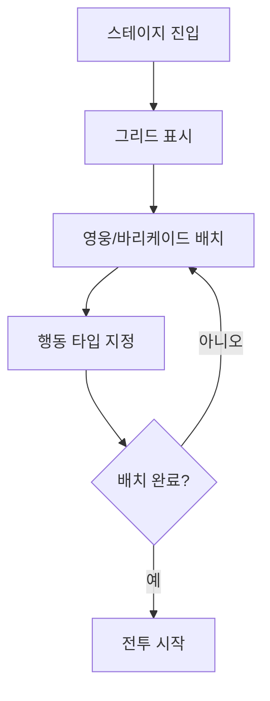
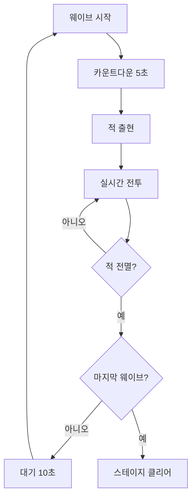

# 스테이지 시스템

[← README로 돌아가기](../README.md)

---

## 맵 구조

### 화면 레이아웃

![[assets/maps/battle_layout.png]]

> 상/하단은 산맥으로 통과 불가 지형

### 시점

- **2D 횡스크롤**: 좌측 성벽, 우측 적 출현
- 픽셀아트 스타일

### 맵 영역 구분

| 영역 | 위치 | 설명 |
|------|------|------|
| 성벽 | 좌측 끝 | 최종 방어선, 성벽 무기 배치 |
| 전투 영역 | 성벽~적 출현 사이 | 영웅/바리케이드 배치 공간 |
| 적 출현 영역 | 우측 | 마물 스폰 지점 |
| 산맥 | 상하단 | 통과 불가 경계 |

### 그리드 구성

```
[산맥] ────────────────────────────────
[성벽] □ □ □ □ □ □ □ □ □ □  ← 전투 영역 (여러 줄)
[성벽] □ □ □ □ □ □ □ □ □ □
[성벽] □ □ □ □ □ □ □ □ □ □
[산맥] ────────────────────────────────
```

| 영역 | 그리드 | 설명 |
|------|--------|------|
| 성벽 위 | 1줄 (세로) | 원거리 영웅 전용, 공간 제한 |
| 전투 영역 | 여러 줄 | 자유 배치, 주 전장 |

---

## 준비 단계

스테이지 진입 후 전투 시작 전, 덱에 담아온 영웅과 바리케이드를 배치하는 단계

### 배치 가능 요소

| 요소 | 설명 | 비용 |
|------|------|------|
| 영웅 부대 | 출격 덱에서 가져온 영웅들 | 없음 |
| 목책 | 적 이동 차단용 장애물 | 소모품 (사용 시 소진) |

### 배치 영역

| 영역 | 배치 가능 | 제약 |
|------|-----------|------|
| 전투 영역 | 영웅, 목책 | 그리드 기반 (타일 단위) |
| 성벽 위 | 영웅 | 1줄, 원거리 공격만 가능 |

### 그리드 점유

모든 배치물은 **1×1 그리드** 점유

### 행동 타입

배치한 영웅에게 행동 타입 지정:

| 타입 | 설명 | 역할 |
|------|------|------|
| **방어** | 위치 사수, 적이 접근해도 이동 안 함 | 모루 (적 고정) |
| **공세** | 범위 내 적 접근 시 적극적으로 이동하여 공격 | 망치 (측면 타격) |

**전술 예시**: 목책으로 병목 → 중앙/좌측 부대 방어로 적 고정 → 우측 부대 공세로 측면 공격

### 준비 단계 흐름



---

## 전투 단계

### 웨이브 시스템

스테이지는 여러 웨이브로 구성

| 스테이지 | 웨이브 수 |
|----------|-----------|
| 1-1 ~ 1-5 | 3개 |
| 중반 | 5개 |
| 후반/보스 | 7개 이상 |

### 웨이브 진행



### 적 행동 패턴

| 패턴 | 설명 |
|------|------|
| 직진 | 성벽을 향해 직진 (기본) |
| 우회 | 측면으로 돌아서 접근 |
| 돌파 | 높은 이동속도로 전선 뚫기 |
| 비행 | 지상 장애물 무시 |

**적의 목표**: 성벽 도달 → 성벽 공격

### 실시간 조작

| 조작 | 방법 | 효과 |
|------|------|------|
| 스킬 사용 | 스킬 버튼 터치 | 해당 영웅의 스킬 발동 |
| 이동 명령 | 영웅 터치 → 위치 지정 | 선택한 위치로 이동 |
| 행동 변경 | 영웅 터치 → 타입 선택 | 방어 ↔ 공세 전환 |

---

## 승리/패배 조건

### 승리

- 모든 웨이브의 적 전멸
- 영웅이 전멸해도 적이 없으면 승리

### 패배

- 성벽 내구도 0 도달

---

## 성벽 무기

성벽에 배치하는 자동 공격 무기

- 출격 시 배치한 무기에 따라 자원 소모 (공격 횟수 무관)
- 영지에서 업그레이드 가능

### 무기 종류

| 무기 | 타입 | 특성 | 출격 비용 |
|------|------|------|----------|
| 발리스타 | 단일 물리 | 관통 | 낮음 |
| 투석기 | 범위 물리 | AoE | 중간 |
| 마법 포대 | 속성 마법 | 상태이상 | 높음 |

### 성벽 내구도

- 스테이지 시작 시 100%
- 적이 성벽 도달 시 공격받음
- 내구도 0 = 패배
- 영지 업그레이드로 최대치 증가

---

## 스테이지 평가

### 별 평가

| 평가 | 조건 |
|------|------|
| ★☆☆ | 스테이지 클리어 |
| ★★☆ | 성벽 내구 80% 이상 |
| ★★★ | 영웅 손실 1링크 이하 |

---

## 관련 문서

- [전투 메카닉](전투%20메카닉.md) - 데미지 계산, 속성 상성
- [스탯 시스템](스탯%20시스템.md) - 엔티티 스탯 정의
- [영웅 시스템](영웅%20시스템.md) - 출격 덱, 역할
- [링크 시스템](영웅/링크%20시스템.md) - HP/링크 손실
- [영지 시스템](영지%20시스템.md) - 성벽 무기 업그레이드
