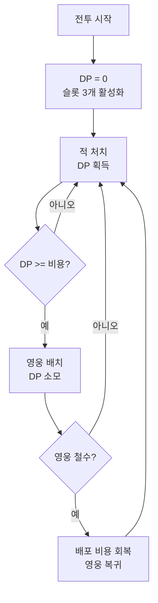
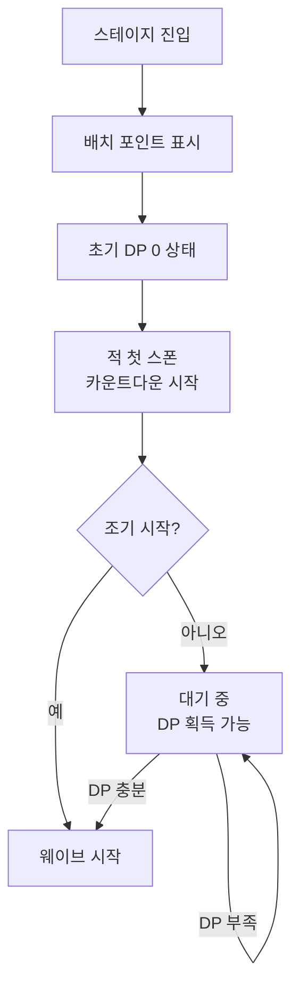
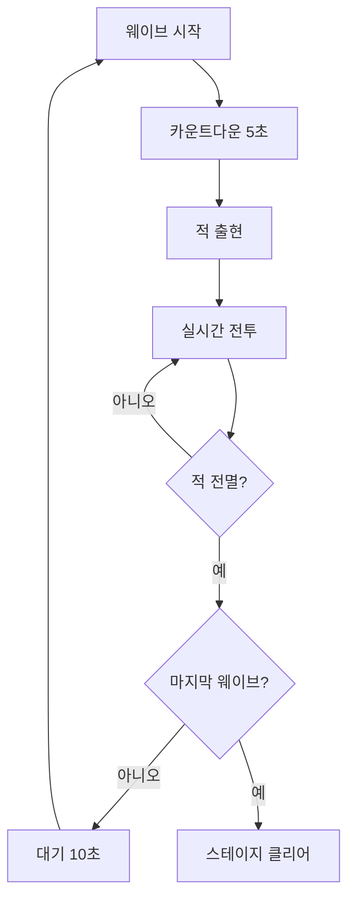

# 스테이지 시스템

[← README로 돌아가기](../README.md)

---

## 개요

에르엘워즈(Arknights) 스타일의 타워 디펜스 시스템. 플레이어는 제한된 배치 슬롯 내에서 영웅을 배치하고, 자동 공격과 수동 스킬 발동으로 적의 침투를 막습니다.

---

## 맵 구조

### 화면 레이아웃

![[assets/maps/battle_layout.png]]

> 지상 2라인 + 공중 1라인 / 좌측 성벽, 우측 적 출현

### 시점

- **2D 횡스크롤**: 좌측 성벽, 우측 적 출현
- 픽셀아트 스타일

### 라인 구조

```
[공중 라인] ══════════════════════════════════════
[지상 상] □──□──□──□──□──□──□──□──□──□──[성벽]
[지상 하] □──□──□──□──□──□──□──□──□──□──[성벽]
```

| 라인 | 특징 | 배치 가능 영웅 |
|------|------|-------------|
| **공중** | 지상 장애물 무시 | 공중 전용 유닛 |
| **지상 상** | 기본 배치 라인 | 모든 유닛 |
| **지상 하** | 기본 배치 라인 | 모든 유닛 |

### 배치 포인트

각 라인별로 **정해진 배치 포인트**에만 배치 가능:

```
[공중]   ◆    ◆    ◆    ◆    ◆
[상]  ◇  ◇  ◇  ◇  ◇  ◇  ◇  [성벽]
[하]  ◇  ◇  ◇  ◇  ◇  ◇  ◇  [성벽]
```

- **◆**: 공중 배치 포인트 (총 5개)
- **◇**: 지상 배치 포인트 (각 라인 7개, 총 14개)
- **[성벽]**: 최종 방어선 (피해 판정)

---

## 배치 슬롯 시스템

### 배포 슬롯 (Deployment Slot)

| 항목 | 설명 |
|------|------|
| 초기 슬롯 | 3개 |
| 최대 슬롯 | 8개 |
| 슬롯 확장 조건 | 게임 진행도/재화로 확장 가능 |

### 배포 비용 (DP: Deployment Points)

- **초기 DP**: 0 (전투 시작 시)
- **DP 획득**: 적 처치 시 1마리당 1DP (초기)
- **DP 회복**: 영웅 철수 시 배포 비용 회복

**배포 비용 예시:**

| 영웅 역할 | 배포 비용 |
|---------|---------|
| 근접 전사 | 15 DP |
| 원거리 딜러 | 12 DP |
| 지원가 | 8 DP |
| 특수 | 20~25 DP |

### 배치 흐름



---

## 준비 단계

스테이지 진입 후 웨이브 시작 전, 영웅을 배치하는 단계

### 초기 배치

1. **스테이지 로드**: 맵 정보, 배치 포인트, 웨이브 구성 확인
2. **슬롯 활성화**: 초기 슬롯 3개 표시 (나머지는 비활성화)
3. **영웅 선택**: 덱에서 영웅 선택 가능
4. **배치 대기**: DP 획득까지 대기 (또는 사전 배치)

### 배치 규칙

| 규칙 | 설명 |
|------|------|
| **배치 포인트** | 정해진 포인트에만 배치 가능 |
| **라인 제약** | 공중 유닛은 공중 포인트에만 배치 |
| **슬롯 소모** | 배치 시 슬롯 1개 소모 |
| **배포 비용** | DP >= 비용이면 배치 가능 |
| **중복 배치 금지** | 한 포인트에 1명만 배치 |

### 준비 단계 흐름



---

## 전투 단계

### 웨이브 시스템

스테이지는 여러 웨이브로 구성

| 스테이지 | 웨이브 수 |
|----------|-----------|
| 1-1 ~ 1-5 | 3개 |
| 중반 | 5개 |
| 후반/보스 | 7개 이상 |

### 웨이브 진행



### 적 행동 패턴

| 패턴 | 설명 |
|------|------|
| 직진 | 성벽을 향해 직진 (기본) |
| 우회 | 측면으로 돌아서 접근 |
| 돌파 | 높은 이동속도로 전선 뚫기 |
| 비행 | 지상 장애물 무시 |

**적의 목표**: 성벽 도달 → 성벽 공격

### 실시간 조작

| 조작 | 방법 | 효과 |
|------|------|------|
| 스킬 사용 | 스킬 버튼 터치 | 해당 영웅의 스킬 발동 |
| 이동 명령 | 영웅 터치 → 위치 지정 | 선택한 위치로 이동 |
| 행동 변경 | 영웅 터치 → 타입 선택 | 방어 ↔ 공세 전환 |

---

## 승리/패배 조건

### 승리

- 모든 웨이브의 적 전멸
- 영웅이 전멸해도 적이 없으면 승리

### 패배

- 성벽 내구도 0 도달

---

## 성벽 무기

성벽에 배치하는 자동 공격 무기

- 출격 시 배치한 무기에 따라 자원 소모 (공격 횟수 무관)
- 영지에서 업그레이드 가능

### 무기 종류

| 무기 | 타입 | 특성 | 출격 비용 |
|------|------|------|----------|
| 발리스타 | 단일 물리 | 관통 | 낮음 |
| 투석기 | 범위 물리 | AoE | 중간 |
| 마법 포대 | 속성 마법 | 상태이상 | 높음 |

### 성벽 내구도

- 스테이지 시작 시 100%
- 적이 성벽 도달 시 공격받음
- 내구도 0 = 패배
- 영지 업그레이드로 최대치 증가

---

## 스테이지 평가

### 별 평가

| 평가 | 조건 |
|------|------|
| ★☆☆ | 스테이지 클리어 |
| ★★☆ | 성벽 내구 80% 이상 |
| ★★★ | 영웅 손실 1링크 이하 |

---

## 관련 문서

- [전투 메카닉](전투%20메카닉.md) - 데미지 계산, 속성 상성
- [스탯 시스템](스탯%20시스템.md) - 엔티티 스탯 정의
- [영웅 시스템](영웅%20시스템.md) - 출격 덱, 역할
- [링크 시스템](영웅/링크%20시스템.md) - HP/링크 손실
- [영지 시스템](영지%20시스템.md) - 성벽 무기 업그레이드
