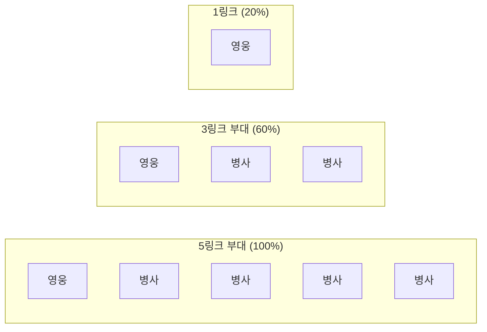
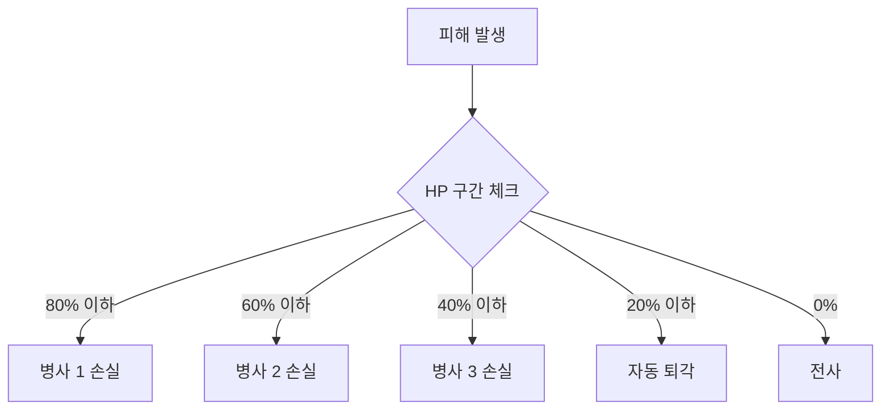

# 링크 시스템 (더미 시스템)

[← 영웅 시스템으로 돌아가기](../영웅%20시스템.md) | [← README로 돌아가기](../../README.md)

---

## 개념

- 영웅 1명이 여러 병사를 지휘
- 병사 = 영웅의 확장 체력/화력
- 링크 수 = 부대 전투력

### 시각적 표현



---

## 링크 구조

### 링크 단계

| 링크 | 구성 |
|------|------|
| 1링크 | 영웅만 (기본) |
| 2링크 | 영웅 + 병사 1명 |
| 3링크 | 영웅 + 병사 2명 |
| 4링크 | 영웅 + 병사 3명 |
| 5링크 | 영웅 + 병사 4명 (최대) |

### 스탯 증가 공식

| 링크 | 스탯 배율 |
|------|-----------|
| 1링크 | 기본 스탯 100% |
| 2링크 | 기본 스탯 180% |
| 3링크 | 기본 스탯 260% |
| 4링크 | 기본 스탯 340% |
| 5링크 | 기본 스탯 420% |

### 링크별 화력

- 각 링크는 개별 공격 가능
- 5링크 = 5배 DPS (단순 계산)
- 실제로는 스킬/버프 등 변수 존재

---

## 링크 확장 방법

### 레벨 조건

| 링크 | 필요 레벨 | 추가 조건 |
|------|-----------|-----------|
| 2링크 | Lv.10 | 재료 소모 |
| 3링크 | Lv.30 | 재료 소모 |
| 4링크 | Lv.70 | 재료 소모 |
| 5링크 | Lv.90 | 재료 소모 |

### 재료 옵션

**1. 동일 영웅 소모**
- 같은 영웅 1명을 재료로 사용
- 중복 뽑기 활용

**2. 범용 코어 사용**

| 코어 | 용도 |
|------|------|
| 일반 코어 | 2링크용 |
| 고급 코어 | 3링크용 |
| 희귀 코어 | 4링크용 |
| 전설 코어 | 5링크용 |

### 코어 획득 방법

- 일일 던전 드롭
- 이벤트 보상
- 상점 구매 (골드 또는 보석)
- 중복 영웅 분해

---

## 전투 중 링크 손실

### 피해 메커니즘

**부대 HP 공식**
```
부대 HP = 영웅 HP + (병사 HP × 병사 수)
```

**예시 (5링크 부대)**
- 영웅 HP: 1000
- 병사 HP (각): 500
- 총 HP: 1000 + (500 × 4) = 3000



### 손실 단계

| 남은 HP | 링크 상태 | 화력 | 상태 |
|---------|-----------|------|------|
| 100~80% | 5링크 | 100% | 정상 |
| 80~60% | 4링크 | 80% | 병사 1 손실 |
| 60~40% | 3링크 | 60% | 병사 2 손실 |
| 40~20% | 2링크 | 40% | 병사 3 손실 |
| 20~1% | 1링크 | 20% | 영웅만 생존 |
| 0% | 전사 | 0% | 부대 전멸 |

### 손실 순서

- 병사부터 먼저 손실 (영웅 보호)
- 영웅은 마지막까지 생존
- HP 구간 진입 시 즉시 링크 감소

### 시각 효과

- 링크 손실 시 병사 유닛 화면에서 사라짐
- 남은 병사만 표시
- HP 바 색상 변화 (녹→황→적)

---

## 자동 퇴각 시스템

### 퇴각 조건

- HP 20% 이하 도달 시 자동 퇴각

### 퇴각 프로세스

1. HP 20% 이하 감지
2. 자동으로 후방 이동 시작
3. 성벽 뒤로 이동 완료
4. 해당 스테이지 내 재출격 불가
5. 스테이지 종료 후 자동 회복

### 퇴각의 의미

- 영웅 전사 방지 (수리 비용 절감)
- 전술적 후퇴 허용
- 하지만 전력 감소로 스테이지 클리어 어려워질 수 있음

---

## 전사 시스템

### 전사 조건

- HP 0 도달

### 전사 시 영향

- 해당 스테이지에서 완전 제외
- 재출격 불가
- 스테이지 실패 시에도 영구 손실 없음

### 전사 후 처리

- 스테이지 성공/실패와 무관하게 전사 처리
- 수리실에서 수리 필요 (높은 비용)

---

## 관련 문서

- [영웅 시스템](../영웅%20시스템.md) - 덱 편성
- [수리 시스템](수리%20시스템.md) - 링크 손실 후 회복
- [스탯 시스템](../스탯%20시스템.md) - HP/스탯 계산
- [스테이지 시스템](../스테이지%20시스템.md) - 전투 중 메커니즘
