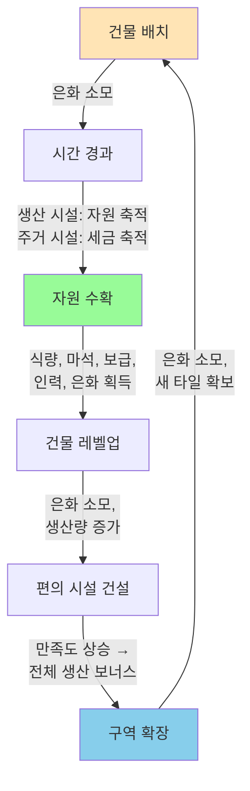

# 생산 시스템

[← 영지 시스템](../영지%20시스템.md)

---

## 핵심 루프



---

## 생산 공식

```
실제 생산량(시간당) = 기본 생산량 × 만족도
```

- **만족도**: [만족도 시스템](만족도%20시스템.md) 참조

---

## 생산 시설 레벨별 수치

### 농장 (식량)

| 레벨 | 시간당 생산 | 최대 저장량 | 업그레이드 비용 |
|------|-------------|-------------|-----------------|
| 1 | 60 | 500 | - |
| 2 | 90 | 750 | 은화 1,000 |
| 3 | 130 | 1,000 | 은화 2,500 |
| 4 | 180 | 1,500 | 은화 5,000 |
| 5 | 250 | 2,000 | 은화 10,000 |

### 마력 정제소 (마석)

| 레벨 | 시간당 생산 | 최대 저장량 | 업그레이드 비용 |
|------|-------------|-------------|-----------------|
| 1 | 30 | 300 | - |
| 2 | 45 | 450 | 은화 1,500 |
| 3 | 65 | 600 | 은화 3,500 |
| 4 | 90 | 900 | 은화 7,000 |
| 5 | 120 | 1,200 | 은화 15,000 |

### 보급창고 (보급)

| 레벨 | 시간당 생산 | 최대 저장량 | 업그레이드 비용 |
|------|-------------|-------------|-----------------|
| 1 | 40 | 400 | - |
| 2 | 60 | 600 | 은화 1,200 |
| 3 | 85 | 800 | 은화 3,000 |
| 4 | 115 | 1,200 | 은화 6,000 |
| 5 | 160 | 1,600 | 은화 12,000 |

### 훈련소 (인력)

| 레벨 | 시간당 생산 | 최대 저장량 | 업그레이드 비용 |
|------|-------------|-------------|-----------------|
| 1 | 20 | 200 | - |
| 2 | 30 | 300 | 은화 2,000 |
| 3 | 45 | 450 | 은화 5,000 |
| 4 | 65 | 600 | 은화 10,000 |
| 5 | 90 | 800 | 은화 20,000 |

---

## 수확 규칙

- **개별 수확**: 생산 건물 클릭 → 저장된 자원 획득
- **전체 수확**: 전체 수확 버튼 → 모든 생산물 + 세금 일괄 획득
- **저장량 초과 시**: 생산 정지 (넘치면 대기, 손실 없음)

---

## 전투 자원 연결

| 생산 시설 | 자원 | 전투 용도 |
|-----------|------|-----------|
| 농장 | 식량 | 출격 부대 유지 (링크 비례) |
| 마력 정제소 | 마석 | 마법 포대 출격 |
| 보급창고 | 보급 | 물리 포탑 출격, 소모품 재료 |
| 훈련소 | 인력 | 링크 확장/수리 |

---

## 생산 계산 (클라이언트 + 서버)

### 클라이언트 로컬 계산

**목적**: 실시간 UI 업데이트, 서버 부하 감소

```csharp
// 클라이언트에서 현재 생산량 계산
public float GetCurrentProduction(BuildingInstance building)
{
    var config = ConfigBuilding.Get(building.BuildingId);
    var levelData = config.Levels[building.Level];
    float satisfaction = CalculateSatisfaction();

    // 기본 생산 속도
    float productionRate = levelData.ProductionPerHour * satisfaction;

    // 경과 시간 계산
    float elapsedSeconds = (DateTime.Now - building.LastHarvestTime).TotalSeconds;

    // 생산량 계산
    float produced = (productionRate / 3600f) * elapsedSeconds;

    // 최대 저장량 제한
    return Mathf.Min(produced, levelData.MaxStorage);
}

// UI 업데이트 (매 프레임 또는 매 초)
public void UpdateProductionUI()
{
    foreach (var building in _gameState.Buildings)
    {
        var config = ConfigBuilding.Get(building.BuildingId);
        if (config.Category != BuildingCategory.PRODUCTION) continue;

        float currentProduction = GetCurrentProduction(building);
        _ui.UpdateProductionDisplay(building.Id, currentProduction);
    }
}
```

---

### 서버 검증 로직

**목적**: 수확 시 클라이언트 계산 검증

```csharp
// POST /api/manor/harvest
public HarvestResult Harvest(int userId, int placementId)
{
    var building = GetBuilding(userId, placementId);
    var config = ConfigBuilding.Get(building.BuildingId);
    var levelData = config.Levels[building.Level];
    float satisfaction = CalculateSatisfaction(userId);

    // 서버에서 재계산 (정합성 보장)
    float productionRate = levelData.ProductionPerHour * satisfaction;
    float elapsedSeconds = (DateTime.Now - building.LastHarvestTime).TotalSeconds;
    float produced = (productionRate / 3600f) * elapsedSeconds;
    produced = Mathf.Min(produced, levelData.MaxStorage);

    // 자원 지급
    int amount = Mathf.FloorToInt(produced);
    AddResource(userId, config.ResourceType, amount);

    // 마지막 수확 시간 갱신
    building.LastHarvestTime = DateTime.Now;
    SaveBuilding(building);

    return new HarvestResult
    {
        Amount = amount,
        ResourceType = config.ResourceType,
        LastHarvestTime = building.LastHarvestTime
    };
}

// POST /api/manor/harvest-all
public HarvestAllResult HarvestAll(int userId)
{
    var results = new List<HarvestResult>();
    foreach (var building in GetBuildings(userId))
    {
        var config = ConfigBuilding.Get(building.BuildingId);
        if (config.Category == BuildingCategory.PRODUCTION)
        {
            results.Add(Harvest(userId, building.Id));
        }
    }

    // 세금도 함께 수확
    var taxResult = HarvestTax(userId);
    results.Add(taxResult);

    return new HarvestAllResult { Results = results };
}
```

---

### 오프라인 생산 (로그인 시)

**목적**: 로그아웃 중 누적된 생산량 복구

```csharp
// 클라이언트에서 로그인 시 호출
public void CalculateOfflineProduction()
{
    foreach (var building in _gameState.Buildings)
    {
        var config = ConfigBuilding.Get(building.BuildingId);
        if (config.Category != BuildingCategory.PRODUCTION) continue;

        float currentProduction = GetCurrentProduction(building);

        // 최대 24시간까지만 누적
        DateTime lastHarvest = building.LastHarvestTime;
        DateTime maxOfflineTime = lastHarvest.AddHours(24);
        if (DateTime.Now > maxOfflineTime)
        {
            // 24시간 이상 경과 시 24시간치만 계산
            float elapsedSeconds = (maxOfflineTime - lastHarvest).TotalSeconds;
            var levelData = config.Levels[building.Level];
            float satisfaction = CalculateSatisfaction();
            float productionRate = levelData.ProductionPerHour * satisfaction;
            currentProduction = Mathf.Min(
                (productionRate / 3600f) * elapsedSeconds,
                levelData.MaxStorage
            );
        }

        _ui.UpdateProductionDisplay(building.Id, currentProduction);
    }
}
```
