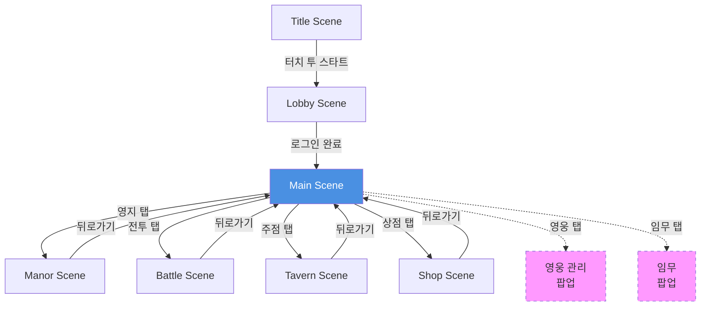
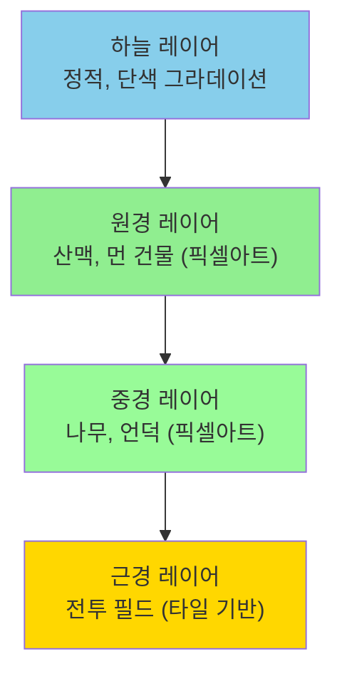

# 아트 방향성 기획서

## 3.1 비주얼 컨셉

### 3.1.1 핵심 아트 방향

**하이브리드 접근**

- **UI/일러스트**: 고해상도 AI 생성 일러스트
- **인게임**: 픽셀아트 기반 애니메이션
- **목표**: 서브컬처 감성 + 타워디펜스 가독성

**분위기**

- 다크 판타지 + 따뜻한 색감
- 절망적이지 않은 긴장감
- 정통 판타지 미학

---

## 3.2 레이어별 아트 전략

### 3.2.1 UI 레이어 (고해상도)

**영웅 초상화**

- 해상도: 1024×1024
- 스타일: 애니메이션 풍 일러스트
- 제작: AI 생성 (Stable Diffusion, NovelAI)
- 용도: 영입 화면, 영웅 상세, 프로필

**UI 요소**

- 해상도: 256×256 ~ 512×512
- 스타일: 판타지 테마 (나무, 가죽, 금속 질감)
- 제작: AI + 에셋 스토어
- 용도: 버튼, 프레임, 아이콘

**스킬 아이콘**

- 해상도: 256×256
- 스타일: 상징적, 화려함
- 제작: AI 또는 에셋 스토어
- 용도: 스킬 표시, 버프/디버프

### 3.2.2 게임플레이 레이어 (픽셀아트)

**캐릭터 유닛**

- 해상도: 32×32 ~ 64×64
- 스타일: 디테일 있는 픽셀아트
- 애니메이션: 4-6 프레임/액션
- 방향: 4방향 (상하좌우) 또는 8방향

**적 유닛**

- 해상도: 32×32 ~ 96×96 (보스)
- 스타일: 어둡고 위협적
- 종류별 차별화된 실루엣

**방어 시설**

- 해상도: 48×48 ~ 96×96
- 스타일: 목재/돌 질감 표현
- 정적 또는 간단한 애니메이션

**이펙트**

- 해상도: 32×32 ~ 64×64
- 스타일: 과장된 표현
- 애니메이션: 4-8 프레임

### 3.2.3 배경 레이어

**전투 배경**

- 제작: AI 생성 → 픽셀화
- 스타일: 변방 요새, 황무지
- 깊이: 3레이어 (원경, 중경, 근경)

**영지 배경**

- 제작: 타일 기반 픽셀아트
- 스타일: 아기자기한 마을
- 건물: 개별 픽셀아트

---

## 3.3 픽셀아트 상세 설계

### 3.3.1 해상도 기준

**화면 기준**

- 베이스 해상도: 1280×720 (가로, 16:9)
- 게임 뷰: 640×360 (2배 스케일링)
- Pixels Per Unit: 16

**유닛 크기 가이드**

|유닛 타입|픽셀 크기|실제 크기 (타일)|
|---|---|---|
|영웅 (보병)|64×64|4×4 타일|
|영웅 (기병)|64×80|4×5 타일|
|병사|32×32|2×2 타일|
|적 (소형)|32×32|2×2 타일|
|적 (중형)|48×48|3×3 타일|
|적 (대형)|64×64|4×4 타일|
|보스|96×96 ~ 128×128|6×6 ~ 8×8 타일|
|방어탑|64×64|4×4 타일|
|목책|48×32|3×2 타일|

### 3.3.2 컬러 팔레트

**전체 팔레트 제한**

- 총 32색 이내
- 일관성 유지를 위한 팔레트 공유

**진영별 컬러 테마**

**아군 (영웅/병사)**

- 주조색: 파랑, 은색, 금색
- 보조색: 흰색, 밝은 갈색
- 강조색: 청록, 하늘색

**적 (마물)**

- 주조색: 붉은색, 보라, 검은색
- 보조색: 어두운 회색, 갈색
- 강조색: 주황, 진홍

**배경**

- 지형: 갈색, 회색 계열
- 하늘: 파스텔 톤
- 식물: 어두운 녹색

**UI**

- 나무: 갈색 계열
- 금속: 은색, 금색
- 강조: 주황, 노랑

### 3.3.3 아웃라인 규칙

**캐릭터/유닛**

- 외곽선: 1px 검은색 또는 어두운 색
- 내부 디테일: 0.5px 또는 없음
- 일관된 두께 유지

**건물/시설**

- 외곽선: 1px
- 그림자: 45도 방향

### 3.3.4 쿼터뷰 픽셀아트 가이드

**각도**

- 2:1 쿼터뷰 (약 26.5도)
- 또는 1:1 쿼터뷰 (45도)

**타일 구조**

- 베이스 타일: 16×16 픽셀
- 등각 타일: 32×16 (2:1) 또는 16×16 (1:1)

**깊이 표현**

- Z축 정렬: Y좌표 기준
- 그림자: 바닥에 투영
- 오버랩: 뒤쪽 유닛 반투명 또는 아웃라인

---

## 3.4 애니메이션 설계

### 3.4.1 필수 애니메이션 (영웅)

**Idle (대기)**

- 프레임: 4프레임
- 속도: 0.5초/루프
- 내용: 호흡, 무기 약간 움직임

**Walk (이동)**

- 프레임: 6프레임
- 속도: 0.6초/루프
- 방향: 4방향 (좌우 대칭 활용)

**Attack (공격)**

- 프레임: 4-6프레임
- 속도: 0.4초
- 내용: 준비 → 공격 → 후속동작

**Hit (피격)**

- 프레임: 2프레임
- 속도: 0.2초
- 내용: 번쩍임 또는 뒤로 밀림

**Death (사망)**

- 프레임: 6프레임
- 속도: 0.8초
- 내용: 쓰러지며 페이드아웃

### 3.4.2 적 애니메이션

**기본 적**

- Idle: 2-4프레임 (단순화)
- Walk: 4프레임
- Attack: 3-4프레임
- Death: 4프레임

**보스**

- Idle: 6프레임 (위압감)
- Walk: 6프레임
- Attack: 8-10프레임 (여러 패턴)
- Special: 10-12프레임 (특수 기술)
- Death: 10프레임 (화려하게)

### 3.4.3 이펙트 애니메이션

**공격 이펙트**

- 물리 타격: 4프레임, 충격 표현
- 화살/투사체: 2-3프레임, 궤적
- 마법: 6-8프레임, 화려함

**버프/디버프**

- 지속: 4프레임 루프
- 아이콘 + 파티클

**환경 효과**

- 폭발: 8프레임
- 불: 4프레임 루프
- 피격: 3프레임 번쩍임

---

## 3.5 캐릭터 디자인 가이드

### 3.5.1 영웅 일러스트 스타일

**전체 방향**

- 애니메이션 스타일 (일본 라이트노벨/소녀전선 참고)
- 판타지 의상
- 개성 있는 실루엣

**AI 생성 프롬프트 구조**

```
[캐릭터 타입] [의상 설명] [포즈] [배경]
판타지, 상세한 갑옷/옷, 전신/반신, 흰 배경
애니메이션 스타일, 고품질, 선명한 라인아트
```

**예시 프롬프트**

```
Female knight, detailed fantasy armor with blue accents,
full body character sheet, white background,
anime style, high quality, sharp lineart,
multiple poses (front, side, back)
```

### 3.5.2 픽셀 캐릭터 변환 프로세스

**방법 A: AI 일러스트 → 픽셀화**

1. AI로 고해상도 일러스트 생성
2. Aseprite에서 불러오기
3. 64×64 캔버스에 다운샘플링
4. 수동으로 픽셀 정리
5. 디테일 추가/제거

**방법 B: 직접 제작 (추천)**

1. AI 일러스트를 레퍼런스로 배치
2. 새 레이어에서 64×64 직접 그리기
3. 주요 형태와 색상만 단순화
4. 실루엣 명확히

### 3.5.3 캐릭터 차별화 전략

**실루엣**

- 직업별 뚜렷한 실루엣
- 무기/장비로 구분
- 크기 차이 (기병 > 보병 > 궁수)

**색상**

- 역할별 주조색 통일
- 탱커: 파랑/은색
- 딜러: 빨강/주황
- 지원: 노랑/흰색
- 원거리: 녹색/하늘색

**애니메이션**

- 공격 모션으로 직업 표현
- 기사: 크게 휘두름
- 궁수: 활 당김
- 마법사: 지팡이 휘두르며 마법진

---

## 3.6 씬 구조 및 전환

### 3.6.1 게임 씬 목록

**씬 구성**

| 씬 이름 | 설명 | 주요 기능 |
|---------|------|-----------|
| **Title** | 타이틀 화면 | 로고, 터치 투 스타트, 버전 정보 |
| **Lobby** | 로비 | 로그인, 서버 연결, 공지사항 |
| **Main** | 메인 허브 | 영지 뷰, 하단 메뉴 네비게이션 |
| **Manor** | 영지 관리 | 건물 배치/업그레이드, 생산, 세금 |
| **Battle** | 전투 | 스테이지 선택 → 전투 플레이 |
| **Tavern** | 주점 | 영웅 모집, 영웅 목록 |
| **Shop** | 상점 | 재화 구매, 아이템 상점 |

### 3.6.2 씬 전환 흐름



> 실선: 씬 전환 / 점선: 팝업 (씬 전환 없음)

### 3.6.3 씬별 상세

**Title Scene**
- 로딩: 0.5초
- 구성: 배경 일러스트 + 로고 + "Touch to Start"
- 전환: 페이드 아웃 → Lobby

**Lobby Scene**
- 로딩: 1-2초 (서버 연결)
- 구성: 로그인 UI, 공지사항 팝업, 로딩 인디케이터
- 전환: 페이드 → Main

**Main Scene**
- 로딩: 즉시 (영지 데이터 미리 로드)
- 구성: 영지 아이소메트릭 뷰 + 상단바 + 하단 메뉴
- 특징: 항상 백그라운드에 유지 (메모리 최적화 대상)

**Manor Scene**
- 로딩: 즉시 (Main과 동일 씬 or Additive 로딩)
- 구성: 영지 확대 뷰, 건물 배치 UI
- 전환: 슬라이드 or 즉시

**Battle Scene**
- 로딩: 1-2초 (적 데이터, 배경 로드)
- 구성: 전투 필드 + 영웅 UI + HUD
- 전환: 암전 → 페이드 인

**Tavern Scene**
- 로딩: 0.5초
- 구성: 주점 배경, 영웅 모집 UI
- 전환: 슬라이드 좌측

**Shop Scene**
- 로딩: 즉시
- 구성: 상점 UI, 상품 목록
- 전환: 슬라이드 우측

### 3.6.4 씬 전환 효과

| 전환 | 효과 | 시간 |
|------|------|------|
| Title → Lobby | Fade Out/In | 0.5초 |
| Lobby → Main | Fade In | 0.3초 |
| Main ↔ Manor | 즉시 or 슬라이드 | 0.2초 |
| Main → Battle | 암전 → Fade | 0.5초 |
| Main → Tavern | 슬라이드 좌 | 0.3초 |
| Main → Shop | 슬라이드 우 | 0.3초 |
| 뒤로가기 | Reverse 효과 | 0.2초 |

### 3.6.5 씬 메모리 관리

**상주 씬**
- Main Scene (백그라운드 유지)

**언로드 대상**
- Battle Scene (전투 종료 시 즉시 언로드)
- Tavern/Shop (나갈 때 언로드)

**프리로드 대상**
- 공통 UI 프리팹
- 자주 사용하는 이펙트

---

## 3.7 UI/UX 아트 디자인

### 3.7.1 UI 스타일 가이드

**전체 테마**

- 중세 판타지 (나무, 가죽, 금속)
- 따뜻한 갈색 톤
- 손으로 그린 듯한 질감

**프레임/창**

- 나무 테두리 + 금속 장식
- 모서리에 장식 요소
- 약간의 그림자로 깊이감

**버튼**

- 3D 느낌의 나무/돌 버튼
- 눌렸을 때 약간 들어가는 애니메이션
- 아이콘 + 텍스트

**텍스트**

- 본문: 고딕 계열 (가독성)
- 제목: 세리프/장식 폰트
- 색상: 흰색 or 밝은 베이지 (어두운 배경 위)

### 3.7.2 화면별 UI 레이아웃

**메인 화면** (1280×720 가로 레이아웃)

```
┌────────────────────────────────────────────────────┐
│ [재화] [플레이어] [설정]                   [메뉴] │ ← 상단바
├────────────────────────────────────────────────────┤
│                                                    │
│                                                    │
│               [영지 배경 - 아이소메트릭]            │
│               [건물들 배치 영역]                   │
│                                                    │
│                                                    │
├────────────────────────────────────────────────────┤
│ [영지] [전투] [영웅] [주점] [상점] [임무]         │ ← 하단 메뉴
└────────────────────────────────────────────────────┘
```

**전투 화면** (1280×720 가로 레이아웃)

```
┌────────────────────────────────────────────────────┐
│ Wave 1/5 | 성벽: ▓▓▓▓▓░░░░░ 50%        [||] [설정] │ ← 상단 HUD
├────────────────────────────────────────────────────┤
│                                                    │
│                                                    │
│            [쿼터뷰 전투 필드 - 넓게]               │
│            [적 출현 → ← 성벽/영웅]                 │
│                                                    │
│                                                    │
├─────┬──────────────────────────────────────────────┤
│영웅1│ HP: ▓▓▓▓░ 80%  [스킬1] [스킬2] [스킬3]      │ ← 하단 영웅 UI
│★★★│ [영웅2] [영웅3] [영웅4] [영웅5]    [후퇴]   │
└─────┴──────────────────────────────────────────────┘
```

**영웅 상세** (1280×720 가로 레이아웃)

```
┌────────────────────────────────────────────────────┐
│ [← 뒤로]  영웅 이름 | Lv.30 | ★★★★★            │ ← 상단바
├──────────────┬─────────────────────────────────────┤
│              │  HP: 1250 / 1500                    │
│              │  ATK: 350  DEF: 180                 │
│ [일러스트]   │  SPD: 120  CRT: 25%                 │
│  (512×512)   │                                     │
│  Live2D      │  링크: ●●●●●                       │
│              │                                     │
│              │  [장비 슬롯 × 4]                    │
│              │  [스킬 1] [스킬 2] [스킬 3]         │
├──────────────┼─────────────────────────────────────┤
│ [강화] [승급] [장비] [링크]              [닫기]   │
└──────────────┴─────────────────────────────────────┘
```

### 3.7.3 아이콘 디자인

**자원 아이콘**

- 골드: 금화 주머니
- 보석: 빛나는 보석
- 인력: 사람 실루엣
- 식량: 빵/밀
- 광물: 광석
- 목재: 통나무

**역할 아이콘**

- 탱커: 방패
- 딜러: 검
- 원거리: 활
- 지원: 십자가/지팡이

**상태 아이콘**

- 버프: 위쪽 화살표 (파랑/금색)
- 디버프: 아래쪽 화살표 (빨강/보라)
- 스턴: 별표
- 독: 해골
- 불: 불꽃
- 빙결: 눈송이

---

## 3.8 배경 아트

### 3.8.1 전투 배경

**레이어 구조**



**스테이지별 배경 테마**

- Chapter 1: 황량한 평원
- Chapter 2: 숲 지대
- Chapter 3: 설산 지역
- Chapter 4: 화산 지대
- Chapter 5: 마경 입구

### 3.8.2 영지 배경

**아이소메트릭 레이아웃**

- 중앙: 성벽 및 주요 건물
- 주변: 생산 시설, 편의 시설
- 외곽: 방어 시설

**건물 픽셀아트**

- 각 건물: 64×64 ~ 128×128
- 레벨업 시 시각적 변화
- 작동 중 애니메이션 (연기, 빛)

---

## 3.9 이펙트 아트

### 3.9.1 전투 이펙트

**타격 이펙트**

- 물리: 흰색/노란색 충격파
- 마법: 해당 속성 색상 폭발
- 치명타: 확대된 이펙트 + 번쩍임

**투사체**

- 화살: 2-3프레임 비행
- 마법탄: 궤적 + 발광
- 포탄: 크게 그려진 궤적

**상태이상**

- 불: 작은 불꽃 파티클
- 빙결: 얼음 크리스탈
- 독: 초록 기포
- 스턴: 머리 위 별

### 3.9.2 UI 이펙트

**버튼 피드백**

- 호버: 밝아짐
- 클릭: 눌림 + 소리
- 비활성: 회색 + 흐림

**전환 효과**

- 화면 전환: 페이드 또는 슬라이드
- 팝업: 스케일 애니메이션
- 보상 획득: 빛나는 효과

---

## 3.10 제작 파이프라인

### 3.10.1 AI 일러스트 제작

**도구**

- Stable Diffusion (WebUI 또는 ComfyUI)
- NovelAI (서브컬처 특화)
- Midjourney (보조)

**워크플로우**

1. 프롬프트 작성 (영웅 컨셉)
2. 여러 변형 생성 (10-20장)
3. 최적 선택
4. ControlNet으로 포즈 조정
5. Inpainting으로 디테일 수정
6. Upscale to 1024×1024
7. Photoshop/Krita로 최종 보정

**프롬프트 템플릿**

```
Positive:
[character description], [clothing details],
[pose], white background,
anime style, high quality, detailed,
sharp lineart, vibrant colors

Negative:
blurry, low quality, duplicate,
malformed, extra limbs, bad anatomy,
watermark, signature
```

### 3.10.2 픽셀아트 제작

**도구**

- Aseprite (유료, $20)
- LibreSprite (무료 대안)
- GraphicsGale (무료, 윈도우)

**워크플로우**

1. AI 일러스트 레퍼런스 배치
2. 64×64 캔버스에 아웃라인
3. 베이스 색상 채우기
4. 쉐이딩 (2-3단계)
5. 디테일 추가
6. 아웃라인 정리
7. 애니메이션 프레임 작업
8. Export as sprite sheet

**애니메이션 제작**

1. Idle 프레임 (기준점)
2. 극한 프레임 작성
3. 중간 프레임 보간
4. 타이밍 조정
5. Onion Skin으로 확인

### 3.10.3 Unity 통합

**스프라이트 설정**

```
Texture Type: Sprite (2D and UI)
Sprite Mode: Multiple
Pixels Per Unit: 16
Filter Mode: Point (no filter) ← 필수!
Compression: None
Max Size: 1024 or 2048
```

**Sprite Sheet 슬라이싱**

- Automatic 또는 Grid 사용
- Pivot: Bottom 또는 Center
- 각 프레임 이름 규칙: "hero_walk_0", "hero_walk_1"...

**Animator Controller**

```
States:
- Idle (기본)
- Walk
- Attack
- Hit
- Death

Transitions:
- 파라미터 기반 (isWalking, isAttacking 등)
- Exit Time 비활성화 (즉시 전환)
```

**Pixel Perfect Camera**

- Component 추가
- Assets Pixels Per Unit: 16
- Reference Resolution: 640×360 (내부 해상도)
- Upscale Render Texture 체크

---

## 3.11 아트 에셋 관리

### 3.11.1 폴더 구조

```
Assets/
├─ Art/
│  ├─ Characters/
│  │  ├─ Heroes/
│  │  │  ├─ Portraits/ (1024×1024 AI 일러스트)
│  │  │  └─ Sprites/ (64×64 픽셀아트)
│  │  ├─ Enemies/
│  │  └─ NPCs/
│  ├─ Environments/
│  │  ├─ Backgrounds/
│  │  ├─ Tilesets/
│  │  └─ Props/
│  ├─ UI/
│  │  ├─ Frames/
│  │  ├─ Buttons/
│  │  ├─ Icons/
│  │  └─ Fonts/
│  ├─ Effects/
│  │  ├─ Particles/
│  │  ├─ Impacts/
│  │  └─ Projectiles/
│  └─ Buildings/
│     ├─ Base/ (건물 기본형)
│     └─ Upgraded/ (업그레이드 버전)
```

### 3.11.2 네이밍 컨벤션

**스프라이트**

```
[type]_[name]_[action]_[frame]

예시:
hero_knight_idle_0
hero_knight_walk_3
enemy_goblin_attack_2
```

**일러스트**

```
[type]_[name]_[variant]

예시:
portrait_knight_base
portrait_knight_5star
portrait_mage_skin01
```

**UI**

```
[category]_[element]_[state]

예시:
btn_primary_normal
btn_primary_pressed
icon_gold_32
frame_window_large
```

### 3.11.3 버전 관리

**원본 파일**

- .ase (Aseprite)
- .psd (Photoshop)
- .kra (Krita)
- Git LFS 또는 별도 클라우드 저장

**익스포트 파일**

- .png (Unity용)
- Git에 포함

---

## 3.12 퍼포먼스 최적화

### 3.12.1 텍스처 최적화

**아틀라스 사용**

- 같은 타입 스프라이트 아틀라스화
- Unity Sprite Atlas 기능
- 드로우콜 감소

**압축 설정**

- 픽셀아트: None (무손실)
- AI 일러스트: ASTC (모바일) 또는 DXT (PC)

**밉맵**

- 픽셀아트: 비활성화
- 배경/UI: 선택적 활성화

### 3.12.2 애니메이션 최적화

**프레임 재사용**

- 좌우 대칭 활용 (Flip)
- 공통 프레임 공유

**LOD (Level of Detail)**

- 카메라에서 멀면 프레임 스킵
- 또는 정적 이미지로 대체

### 3.12.3 파티클 최적화

**제한**

- 동시 파티클 수 제한
- 화면 밖 파티클 자동 제거

**풀링**

- 파티클 오브젝트 재사용
- 매 프레임 Instantiate 방지

---

## 3.13 라이브러리 & 도구

### 3.13.1 필수 도구

**픽셀아트**

- Aseprite ($20) - 픽셀 애니메이션 최고
- Aseprite Scripts (확장)

**AI 생성**

- Stable Diffusion WebUI (무료)
- ControlNet Extension
- LoRA Models (서브컬처 스타일)

**편집**

- Krita (무료) - 이미지 편집
- GIMP (무료 대안)

**유틸리티**

- TexturePacker - 스프라이트 시트 생성
- Spriter/Spine - 본 애니메이션 (선택적)

### 3.13.2 에셋 스토어 추천

**Unity Asset Store**

- Fantasy UI Pack (베이스)
- Pixel Art Icon Pack
- Particle Effects Pack

**Itch.io**

- 픽셀 폰트 (무료)
- 픽셀 이펙트 (무료/유료)

### 3.13.3 레퍼런스 & 영감

**게임**

- 소녀전선 (일러스트 + 픽셀 조합)
- 명일방주 (UI/UX)
- Darkest Dungeon (분위기)
- Into the Breach (픽셀 타워디펜스)
- Slay the Spire (UI)

**픽셀아트 아티스트**

- eBoy
- Paul Robertson
- Waneella
- MortMort

---

## 3.14 Live2D 적용 (선택적)

### 3.14.1 적용 범위

**5성 영웅만**

- 개발 비용 고려
- 프리미엄 느낌

**적용 화면**

- 영웅 상세 화면
- 승급 완료 연출
- 주점 특별 손님

### 3.14.2 제작 프로세스

**준비**

1. AI 일러스트 레이어 분리
    - 얼굴 부위 (눈, 입, 눈썹)
    - 머리카락 (앞머리, 뒷머리)
    - 몸통, 팔, 다리
    - 장식 요소

**Live2D Cubism** 2. PSD 임포트 3. 메쉬 생성 4. 디포머 설정 5. 파라미터 애니메이션 6. 물리 시뮬레이션 (머리카락, 옷)

**Unity 통합** 7. Live2D SDK for Unity 8. Cubism 모델 임포트 9. 애니메이션 트리거 설정

---

## 3.15 스타일 가이드 문서

### 3.15.1 컬러 팔레트

**메인 팔레트** (16진수 코드)

```
아군 블루: #4A90E2
아군 실버: #C0C0C0
아군 골드: #FFD700

적 레드: #C41E3A
적 퍼플: #8B008B
적 블랙: #1C1C1C

배경 브라운: #8B4513
배경 그레이: #696969
배경 그린: #228B22

UI 우드: #D2691E
UI 메탈: #B0B0B0
```

### 3.15.2 타이포그래피

**폰트**

- 제목: Medieval/Fantasy 세리프
- 본문: 고딕 (한글: 나눔고딕)
- 숫자: 모노스페이스

**크기**

- H1: 32pt
- H2: 24pt
- Body: 16pt
- Caption: 12pt

### 3.15.3 간격/여백

**패딩**

- 작음: 8px
- 중간: 16px
- 큼: 24px

**마진**

- 요소 간: 8-16px
- 섹션 간: 24-32px

---

## 3.16 제작 일정 예시

### 프로토타입 단계 (2주)

- 플레이스홀더: 단색 박스 (1일)
- 기본 UI 프레임 (2일)
- 영웅 5명 픽셀아트 (5일)
- 적 3종 픽셀아트 (2일)
- 기본 이펙트 (2일)

### Vertical Slice (4주)

- 영웅 일러스트 10명 AI 생성 (3일)
- 픽셀아트 15명 (10일)
- 배경 3종 (5일)
- UI 전체 (7일)
- 이펙트 확장 (3일)

### MVP (8주)

- 영웅 일러스트 30명 (7일)
- 픽셀아트 30명 (15일)
- 적 10종 (8일)
- 배경 5종 (7일)
- 건물 픽셀아트 10종 (7일)
- 이펙트 완성 (7일)
- Live2D 5명 (선택, 10일)

---

## 3.17 품질 체크리스트

### 일러스트

- [ ] 1024×1024 해상도
- [ ] 흰 배경 or 투명 배경
- [ ] 레이어 분리 (Live2D용)
- [ ] 일관된 라이팅
- [ ] 일관된 스타일

### 픽셀아트

- [ ] 픽셀 퍼펙트 (흐릿함 없음)
- [ ] 아웃라인 일관성
- [ ] 팔레트 준수
- [ ] 애니메이션 루프 자연스러움
- [ ] 모든 방향 완성

### UI

- [ ] 읽기 쉬운 텍스트
- [ ] 명확한 버튼 피드백
- [ ] 일관된 스타일
- [ ] 모바일 터치 고려 (최소 44px)

---

## 3.18 최종 정리

### 핵심 원칙

1. **일관성**: 모든 에셋이 같은 세계관
2. **가독성**: 픽셀아트는 명확한 실루엣
3. **효율성**: AI 활용으로 속도 확보
4. **품질**: 프로그래머도 만들 수 있는 수준

### 프로그래머 팀을 위한 조언

- 픽셀아트는 학습 곡선 낮음 (Aseprite 1주 습득 가능)
- AI 일러스트는 프롬프트 관리가 핵심
- 에셋 스토어 적극 활용
- 일관성 > 개별 퀄리티

### 확장 가능성

- 시즌 업데이트: 새 영웅 추가 용이
- 스킨 시스템: 일러스트만 교체
- 이벤트: 배경/적 재활용
- 픽셀아트 커뮤니티 협업 가능

---

**이 아트 방향성을 따르면:**

- 서브컬처 유저에게 어필하는 고품질 일러스트
- 타워디펜스에 최적화된 명확한 픽셀 전투
- 프로그래머 중심 팀도 제작 가능한 현실성
- AI 도구로 개발 속도 극대화